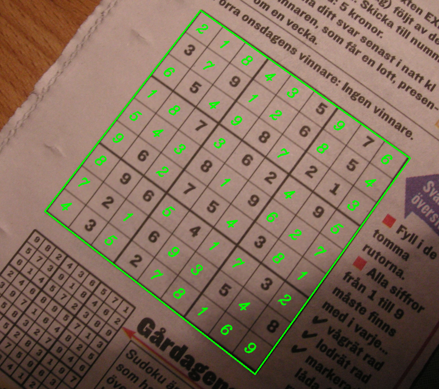
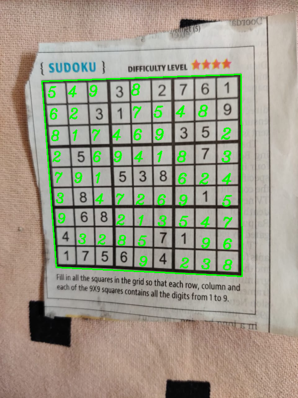

<h1 align="center"> :four: Sudoku Solver :two:</h1>

<p align="center">
  <br>
  <b><i>Detecting, Recognizing and Solving Sudokus using OpenCV, PIL and TensorFlow.</i></b>
  <br><br>
</p>

<h1 align="center"> :wrench: Dependencies and Installation </h1>
Run the following commands either in the global environment or in a virtual environment (<i>recommended</i>).
<br><br>

```
>pip install tensorflow>=2.2.0
>pip install opencv
>pip install scikit-learn
>pip install matplotlib
>pip install PIL
```

<h1 align="center"> :runner: How to Run? </h1>
Open a terminal and run the following commands.

For image version:
<br>

```
>python sudoku_solver.py -i $path_to_img$
```

<br>
For webcam:
<br>

```
>python sudoku_solver_video.py
```

<br>
For exisiting video:

```
>python sudoku_solver_video.py -v $path_to_video$
```

<h1 align="center">:fire: Output</h1>

* For the image version, displays and saves the input image with the sudoku solved. 
* A digital image is also generated of the solved grid, with the empty cells in green.
* For the video and webcam version, it displays the video with the empty cells filled in.
* In both versions, the unsolved and solved grids are printed to the terminal.


<h1 align="center">:bar_chart: Results</h1>

<h2>Example 1</h2>
<p align="center">
  <br><br>
  
  <br>  
  
  <br>
  
  <br><br>
</p>

<h2>Example 2</h2>
<p align="center">
  <br><br>
  
  <br>
  
  <br>
  
  <br><br>
</p>
 
<h2>Example 3</h2> 
<p align="center">
  <br><br>
  
  <br>
  
  <br>
  
  <br><br>
</p>


<h1 align="center"> :scroll: Details</h1>

* Preprocessing done using OpenCV, using the Preprocessor class, having two methods, ```extract_grid``` and ```extract_digit```. 
* The first one extracts the grid from the input image, and the second one extracts the digit from a given cell by thresholding, removing any cell lines, straightening and centralizing it.
* The grid is extracted and then the perspective is transformed, to give a straight view of the grid. Later, after solving, this grid is placed back into its original position using ```findHomography```
and ```warpPerspective```  functions of OpenCV.
* If the ```extract_grid``` doesn't find a sudoku grid, it returns None, and if the ```extract_digit``` finds the cell to be empty, it also returns None.
* Before being passed into the model, digits are straightened and centralized to maintain a similar structure to that of the training data.
* The ```DigitGenerator``` class has been implemented to generate digits artificially using a multitude of different fonts.
* The dataset was generated by combining the MNIST dataset and the generated dataset, to help improve recognition of different (written and printed) types of digits.
* Two different architectures were trained. ```DigitNet``` for images, and ```LeNet``` for videos as DigitNet has a lot more parameters and thus is not suitable for real time video processing.
* The prediction for images is done using an ensemble of 5 CNN's ```DigitNet```, for more accurate predictions.
* Custom Image Augmentation is also applied for the image version during prediction time using the ```DigitAugmenter``` class, so the models see multiple transformed versions of the same image 
for a single prediction, and the highest average prediction is chosen to improve generalization and robustness.
* Each of the five CNN's of ```DigitNet``` gave a validation accuracy over 99.7% on the dataset, while ```LeNet``` gave 99.62%.
* The ```SolutionGenerator``` class is implemented to generate a digital version of the solved sudoku grid using PIL, with the initially empty cells filled with green.
* In the video version, a file ```temp.txt``` is created to make sure that the same grid and its solution doesn't get printed over and over again. After the video is ended, the file is deleted.
<br>
  
                                                                                      
<h1 align="center">:clap: Credits and Inspiration</h1>

* <i>Dr. Adrian Rosebrock</i> - His book on OpenCV and his blog have helped tremendously.
* ```imutils.py``` is a modified version of Dr. Rosebrock's package ```imutils```.
* Architecture of the CNN used for the video was inspired by LeNet.
* Architecture of the CNN's DigitNet was inspired by [this post.](https://www.kaggle.com/cdeotte/how-to-choose-cnn-architecture-mnist/)
* The algorithm for solving the Sudoku is by Peter Norvig and can be found [here](https://norvig.com/sudoku.html).
<br><br>


<h1 align="center">:pray: Thanks!</h1>

<p align="center">
  <b>All contributions are welcome and appreciated. :+1: </b>
  <br><br>
  <br>
  <b> BYE! </b><br><br>
  <a href="https://github.com/rg089"></a>
  <br>
  <b><i>Rishabh Gupta :copyright: </i></b>
</p>
